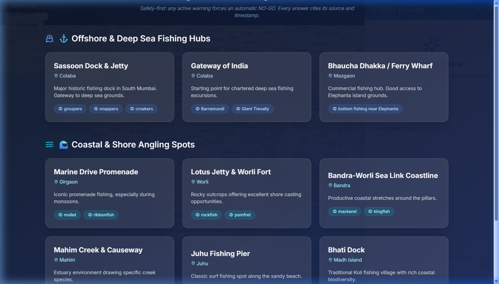
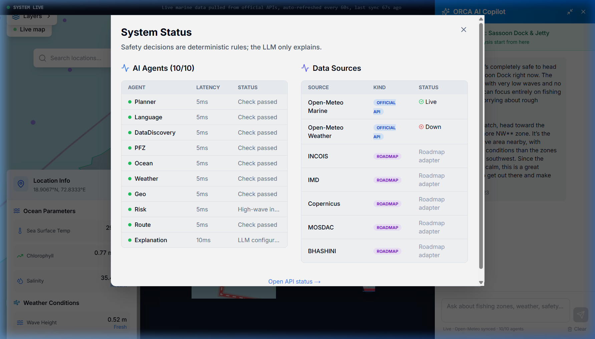
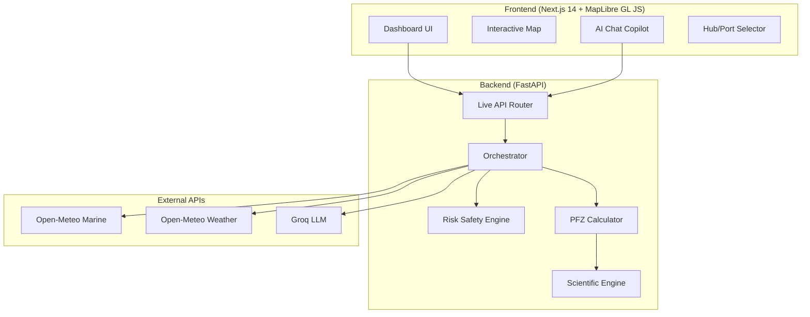

# ORCA: Marine EcoSystem Reasoning with Collaborative Agents

> **Smart India Hackathon 2026** · Problem Statement **SIH26176** · Theme: Space Technology · Category: Software  
> **Team GODSPLAN** · Team ID **158806**

[](https://sih-2026-eight-sigma.vercel.app)
[](https://youtu.be/Bw5V4UZhub4)
[](LICENSE)

---

## Problem

Indian fishermen receive fragmented, delayed ocean advisories from multiple agencies (INCOIS, IMD, MOSDAC). There is no single platform that combines live weather, sea-state, and satellite oceanography to give a simple, evidence-backed **GO / CAUTION / NO-GO** safety verdict before they set sail.

## Solution

ORCA is an AI-powered marine intelligence platform that:

1. **Fetches live ocean and weather data** (currently from Open-Meteo; INCOIS/IMD/Copernicus adapters are roadmap).
2. **Computes Potential Fishing Zones (PFZ)** using deterministic SST-gradient and chlorophyll heuristics from the INCOIS Scientific Rulebook.
3. **Calculates a safety risk verdict** (GO / CAUTION / NO-GO) based on wave height and wind speed thresholds.
4. **Explains results in plain language** via a Groq-powered AI chat copilot — no technical jargon.
5. **Displays everything on an interactive marine map** (MapLibre GL JS) with selectable data layers.

---

## Live System Status




## What Works Today vs Roadmap

_Based on [docs/AUDIT.md](docs/AUDIT.md)._

| Feature | Status | Notes |
|---------|--------|-------|
| Interactive marine map with data layers | ✅ Working | MapLibre GL JS, SST/Chl/Wind/Salinity/PFZ layers |
| AI Chat Copilot | ✅ Working | Groq LLM; requires `GROQ_API_KEY` |
| PFZ zone computation | ✅ Working | Deterministic engine from SST + CHL gradients |
| Deterministic risk engine | ✅ Working | Wave >4m or Wind >60km/h → CRITICAL |
| Hub/Port selector (10 Indian ports) | ✅ Working | Hardcoded port list with coordinates |
| Live wave, wind, temperature data | ✅ Working | Open-Meteo Marine + Weather APIs |
| SST and Ocean currents | ✅ Live | Open-Meteo Marine API |
| Chlorophyll-a values | ⚠️ Derived | Heuristic from wave mixing + coastal proximity |
| Salinity values | ⚠️ Derived | Heuristic from humidity + latitude |
| INCOIS/IMD/Copernicus/MOSDAC data | 📋 Roadmap | Connector skeletons exist; no live data |
| Vessel-class safety thresholds | ✅ Working | Configured via `safety_thresholds.py` |
| Multi-agent orchestration | ✅ Working | 10 custom python agents coordinate responses |
| BHASHINI multilingual translation | 📋 Roadmap | Not implemented |
| Voice input/output | 📋 Roadmap | Not implemented |
| Evidence panel with provenance | ✅ Working | Chat responses include data provenance |
| Decision audit log | ✅ Working | GET `/api/audit` endpoint tracks all verdicts |

---

## Data Sources

| Source | Status | What It Provides |
|--------|--------|------------------|
| **Open-Meteo Marine API** | ✅ Live | Wave height, direction, period, swell |
| **Open-Meteo Weather API** | ✅ Live | Wind speed/direction, temperature, humidity, pressure |
| **Groq LLM API** | ✅ Live | Natural-language explanations of conditions |
| INCOIS ERDDAP | 📋 Roadmap | SST, chlorophyll (connector skeleton exists) |
| IMD Weather API | 📋 Roadmap | Official Indian weather warnings |
| Copernicus Marine | 📋 Roadmap | Global ocean model data |
| MOSDAC (ISRO) | 📋 Roadmap | Satellite telemetry, cloud cover |

---

## Architecture



### Backend Modules

| Module | File | Purpose |
|--------|------|---------|
| Live API | `backend/app/live_api.py` | All HTTP endpoints (health, sources, observations, PFZ, chat, recommendations, ports) |
| Orchestrator | `backend/app/services/orchestrator.py` | Fetches live data, computes PFZ, formats LLM context, determines risk |
| Scientific Engine | `backend/app/services/scientific_engine.py` | PFZ zone calculator using SST gradients, thermal fronts, species habitats |
| Risk Engine | `orchestrator.py:RiskSafetyEngine` | Deterministic GO/CAUTION/NO-GO based on wave height and wind speed |
| Config | `backend/app/core/config.py` | Environment variable management via Pydantic Settings |

The risk engine in `app.config.safety_thresholds` uses distinct GO / CAUTION / NO-GO thresholds based on four vessel classes: `traditional`, `motorised`, `mechanised`, and `deepsea`. Additionally, it includes an override mechanism for simulated cyclone scenarios.

---

## Getting Started

### Prerequisites

- Node.js 18+ and npm
- Python 3.10+
- (Optional) PostgreSQL 14+ with PostGIS for database features
- A [Groq API key](https://console.groq.com/) for the AI chat

### 1. Clone and configure

```bash
git clone https://github.com/kanglesoham11-code/sih_2026.git
cd sih_2026
cp .env.example .env
# Edit .env and add your GROQ_API_KEY
```

### 2. Backend

```bash
cd backend
python -m venv venv

# Windows
venv\Scripts\activate
# macOS/Linux
source venv/bin/activate

pip install -r requirements.txt
uvicorn app.main:app --reload --port 8000
```

### 3. Frontend

```bash
cd frontend
npm install
npm run dev
```

Open [http://localhost:3000](http://localhost:3000).

### Environment Variables

| Variable | Required | Description |
|----------|----------|-------------|
| `GROQ_API_KEY` | Yes | Groq API key for AI chat |
| `DATABASE_URL` | No | PostgreSQL connection string (in-memory fallback if missing) |
| `ALLOWED_ORIGINS` | No | Comma-separated CORS origins |
| `NEXT_PUBLIC_API_URL` | Yes (frontend) | Backend API URL (default: `http://localhost:8000`) |
| `APP_ENV` | No | `development` or `production` |

### API Endpoints

| Method | Path | Description |
|--------|------|-------------|
| GET | `/health` | Health check |
| GET | `/api/sources` | Data source status |
| GET | `/api/observations?lat=&lon=` | Live ocean + weather data |
| GET | `/api/pfz?min_lat=&max_lat=&min_lon=&max_lon=` | Potential Fishing Zones |
| POST | `/api/chat` | AI chat (JSON body: `{message, session_id?, location?}`) |
| GET | `/api/recommendations?lat=&lon=` | Fishing recommendations |
| GET | `/api/ports` | List of fishing ports |
| GET | `/api/audit` | Retrieves recent deterministic safety decisions |

---

## Team

> **TODO: Add team member names and roles here.**

Team GODSPLAN — Smart India Hackathon 2026

---

## Limitations

- **Prototype scope**: Focused on the Mumbai/Maharashtra coastal area. Pan-India coverage is roadmap.
- **Data latency**: Open-Meteo data updates hourly. Real INCOIS PFZ advisories are daily.
- **Chlorophyll, salinity**: Currently derived from proxy calculations, not satellite observations.
- **Free-tier hosting**: Backend on Render free tier may have ~30s cold-start delays.

---

## License

[MIT](LICENSE)

---

<sub>Built for Smart India Hackathon 2026 · Problem Statement SIH26176 · Theme: Space Technology</sub>
